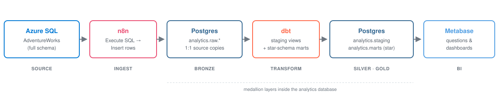
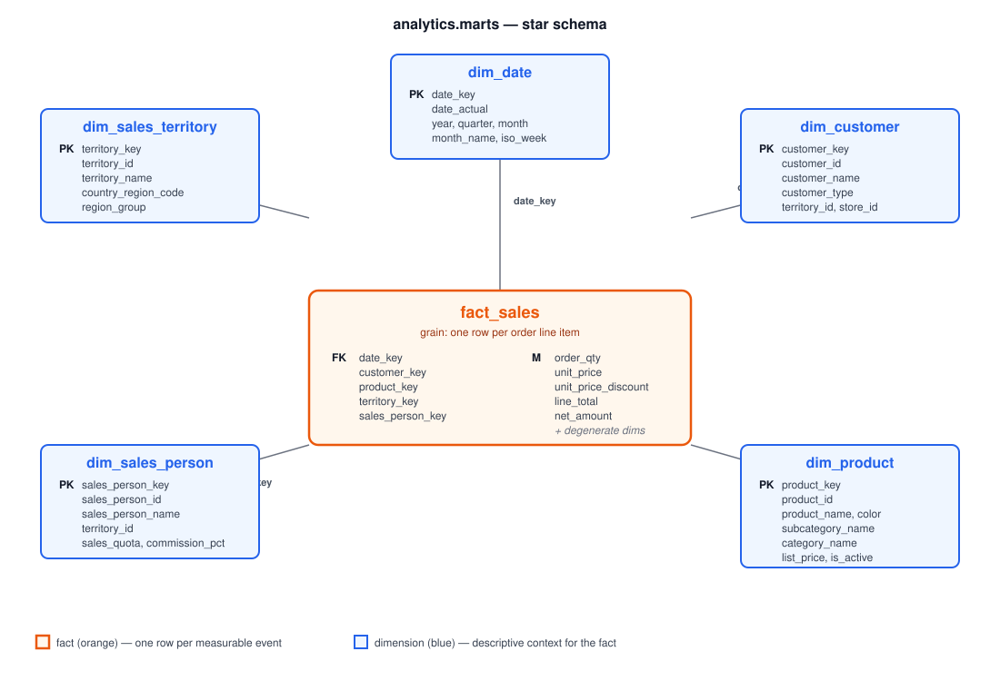

# dbt + Kestra + Postgres Codespace Demo

Codespace environment for the workshop.

## What we're doing

We build a small end-to-end data pipeline:

<p align="center">
  
</p>

- **Source:** the full **AdventureWorks** sample database hosted on Azure SQL (not AdventureWorksLT — we use the complete schema with `Sales`, `Production`, `Person`, `HumanResources`, etc.).
- **Ingest with Kestra:** a YAML flow ([`flows/bronze_adventureworks.yml`](flows/bronze_adventureworks.yml)) queries Azure SQL and inserts the result into the `raw` schema of the local Postgres via `Postgres.Batch`. Credentials are entered at execution time (or pre-filled as defaults).
- **Transform with dbt:** a dbt project on top of Postgres turns the raw tables into clean staging views and curated marts. DuckDB is wired up as an alternative target for offline experiments.
- **Everything runs in a Codespace:** Postgres, Kestra, and dbt are containers in one `docker-compose` stack. Students fork the repo, open it in a Codespace, and have the full environment in a few minutes.

> A BI layer (Metabase) will be added later — for now everything stops at the dbt marts.

### The end state — a star schema

By the end of the tutorial, the `analytics.marts.*` schema will hold this Kimball-style star — that's the deliverable students build during Tasks 2 and 3.

<p align="center">
  
</p>

One fact table at the centre (`fact_sales`, grain = one row per order line item), five conformed dimensions around it, surrogate-key joins all the way through. Anything you can answer about AdventureWorks sales — by territory, by product category, over time, per salesperson — drops out of querying this layer.

## Stack

- **Postgres 16** as the warehouse, with three DBs: `analytics` (AdventureWorks target), `playground` (dbt warm-up), `kestra` (backing store)
- **Kestra** for orchestrating the bronze ingestion (declarative YAML flows, JDBC source/destination)
- **dbt** (Postgres + DuckDB adapters) as a uv-managed Python project, with named targets for `playground` (default) and `analytics`
- VS Code extensions: dbt Power User and SQLTools (with the PostgreSQL driver) — pre-configured connections for all three DBs
- `docker` CLI available inside the workspace (via docker-outside-of-docker) for `docker logs`, `docker exec`, etc.

## Quickstart

1. Fork the repository on GitHub.
2. In your fork: **Code → Codespaces → Create codespace on main**.
3. On first start, Codespaces builds the image and runs `uv sync` (~2–3 min). Kestra adds another ~30–60 s for JVM warmup on first launch.
4. Once the codespace is ready, these ports are forwarded automatically:
   - **8090** → Kestra UI (auto-opens in the preview pane)
   - **8080** → dbt docs (when you run `dbt docs serve`)
   - **5432** → Postgres

For the full guided path (bronze → silver → gold), see [`tutorial/README.md`](tutorial/README.md).

## Using dbt

The venv is activated automatically (via `~/.bashrc`). In a new terminal:

```bash
cd dbt
dbt debug          # checks the Postgres connection
dbt seed           # loads the example CSVs into raw.*
dbt run            # builds staging views and marts tables
dbt test           # runs the tests
```

### Library warm-up (default target: `playground`)

The repo ships a small **library domain** example so the toolchain is verifiable on day one without depending on Kestra or AdventureWorks:

- Seeds: `raw_books`, `raw_members`, `raw_loans`
- Staging: `stg_books`, `stg_members`, `stg_loans`
- Marts: `book_popularity`, `member_activity`

These are written into the **`playground`** Postgres database (separate from `analytics`, so the warm-up never collides with the AdventureWorks pipeline). The default target in `profiles.yml` points there, so `dbt seed && dbt run && dbt test` just works.

### Switching targets

`dbt/profiles.yml` defines three named outputs:

| Target       | Backend                 | Use case                                                     |
| ------------ | ----------------------- | ------------------------------------------------------------ |
| `playground` | Postgres `playground` DB | **default** — library warm-up                                |
| `analytics`  | Postgres `analytics` DB  | the real project against AdventureWorks data ingested by Kestra |
| `duckdb`     | local file              | offline experiments                                          |

```bash
dbt run                       # default → playground
dbt run --target analytics    # against the analytics warehouse
dbt run --target duckdb       # writes ./analytics.duckdb (gitignored)
```

## Querying Postgres directly

From the terminal:

```bash
psql                           # drops into the playground DB by default
psql -d analytics              # switch DB (or kestra)
```

Or use the **SQLTools** sidebar in VS Code (database icon in the activity bar). Three connections are pre-configured — `analytics`, `playground`, `kestra`. Click any of them, then "Connect", no password prompt.

Schemas inside the `playground` and `analytics` DBs after `dbt run`:
- `raw` — seeds / ingested tables
- `staging` — views
- `marts` — tables

## Kestra

UI on port **8090**. The sandbox config has authentication off — you land directly in the dashboard.

The container mounts the repo's [`flows/`](flows/) directory read-only into `/app/flows`, so any YAML flow you commit shows up automatically in the UI under its declared `namespace`. Kestra's own state (executions, logs, schedules) lives in the `kestra` Postgres database and survives container restarts.

The bronze ingestion flow [`bronze_adventureworks.yml`](flows/bronze_adventureworks.yml) declares its Azure SQL credentials as **inputs** — Kestra prompts for them at execution time, so they never need to be checked into git or set as Codespace secrets.

## Layout

```
.devcontainer/
  Dockerfile           # Python 3.12 + uv + psql client
  devcontainer.json    # Codespace config (ports, postCreate, extensions, docker-in-docker)
  docker-compose.yml   # workspace + postgres + kestra
  postgres-init/
    01-init-databases.sh   # creates kestra and playground DBs
flows/
  bronze_adventureworks.yml  # Kestra flow: worked example for one AdventureWorks table → analytics.raw
dbt/
  pyproject.toml       # uv: dbt-core, dbt-postgres, dbt-duckdb
  dbt_project.yml
  profiles.yml         # playground (default) + analytics + duckdb targets
  seeds/               # raw_books.csv, raw_members.csv, raw_loans.csv (library warm-up)
  models/
    staging/           # stg_books, stg_members, stg_loans (views)
    marts/             # book_popularity, member_activity (tables)
tutorial/              # guided workshop (Bronze → Silver → Gold)
```

## Notes

- Postgres and Kestra data persist in Docker volumes (`postgres-data`, `kestra-data`). Stopping the codespace keeps them; deleting the codespace wipes them.
- If `uv sync` fails, run it manually in `dbt/` and open a new terminal.
